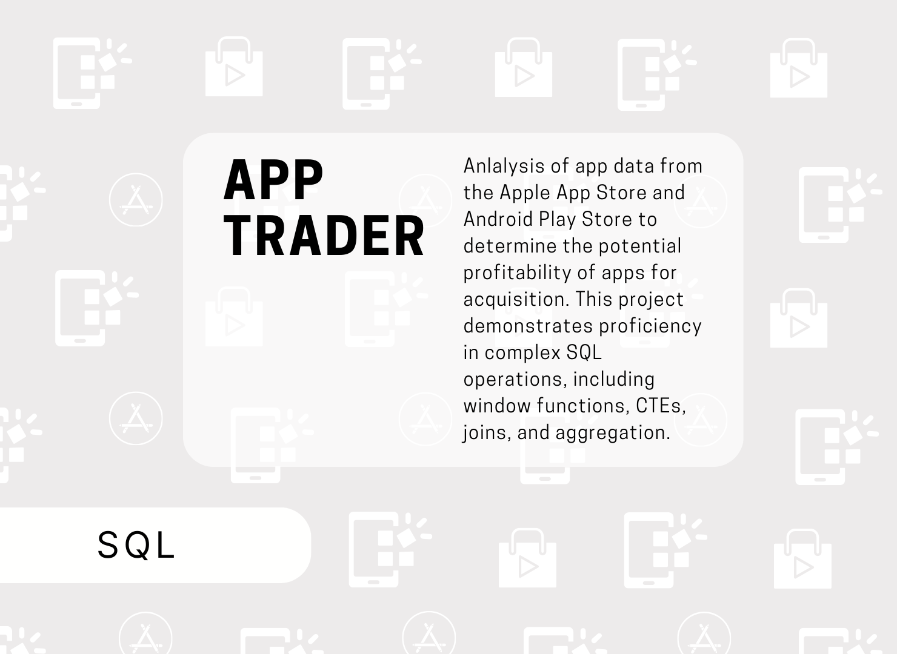

# App Trader Project (SQL)

In this project for App Trader, I utilized SQL to analyze app data from the Apple App Store and Android Play Store, which were stored in separate tables without referential integrity. My primary focus was on determining the potential profitability of apps for acquisition. 

# Key Tasks: 
  * Data Transformation & Cleaning: Cleaned and standardized price data across both platforms using SQL functions such as TRIM and REPLACE.
  * Profit & Lifespan Calculation: Calculated app purchase prices, projected lifespan, and marketing costs using SQL functions like GREATEST and mathematical formulas.
  * Cross-Platform Comparison: Joined tables based on app names and calculated profitability metrics, such as total revenue and net profit.
  * Recommendations: Developed queries to create a "Top 10 Apps" list and provide insights into the best apps to target for acquisition based on profitability.

This project demonstrates proficiency in complex SQL operations, including window functions, CTEs, joins, and aggregation.
